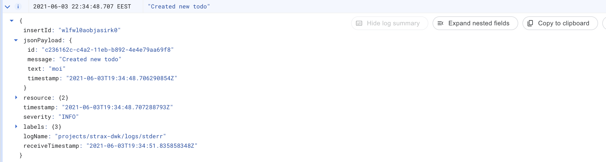

## Exercise 3.06: DBaaS vs DIY

### Cloud SQL

Pros:

* Minimal operational overhead after set-up
* Can choose dedicated resources for DB
* Has automatic backups

Cons:

* Set-up and configuration is done via the GCP API or console instead of Kubernetes resource manifests; declarative configuration requires additional tooling such as Terraform
* Requires service account configuration to enable access from Kubernetes workloads to the database
* Requires a sidecar container (or a separate service) to proxy connection to the database
* Extra cost compared to running in Kubernetes (assuming the database does not saturate nodes)
* **Causes vendor lock to GCP compared to Kubernetes**

### Kubernetes `StatefulSet`

Pros:

* Configuration via Kubernetes resource manifests; integrates with other tools like Kustomize
* Fine-grained resource limits
* Uses cluster resources without additional intrinsic cost
* Can work on any Kubernetes cluster regardless of vendor
* Usable as a normal Kubernetes service within the cluster

Cons:

* Need to write the KRPs
* Need to manually manage the database; this would include tuning PostgreSQL parameters and a custom backup solution in a real world usecase
* Scaling and replicating the database would cause a lot of extra work

## Exercise 3.07: Commitment

Since the database is already set up as a StatefulSet and the estimated load of the database is neglible for the project, I chose to use the StatefulSet solution. In addition this avoids GCP lock-in which is important when the credits run out.

## Exercise 3.10: Project v1.6

